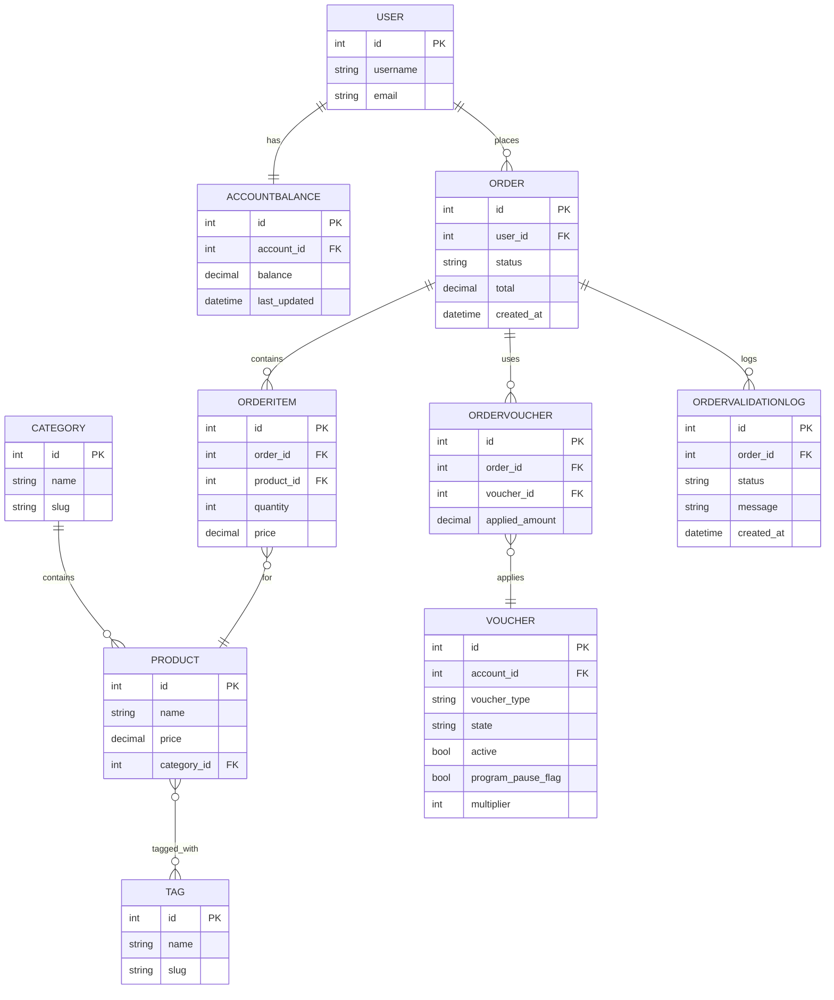
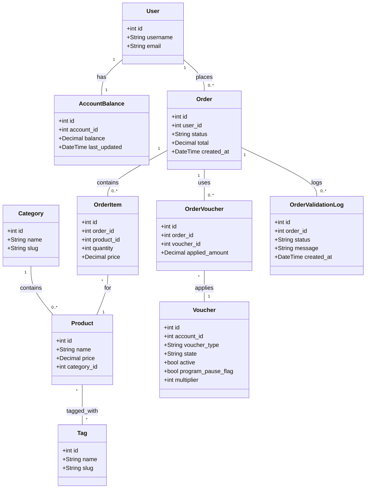

# Architecture Overview

> Last updated: January 2026

This Django project follows a modular app layout. High-level apps of interest:

- `apps/account` — account and balance models
- `apps/pantry` — product/catalog, categories, mobile-first ordering UI
- `apps/orders` — order models, voucher consumption, order validation
- `apps/voucher` — voucher models and validation
- `apps/log` — logging, order validation logs
- `core` — project settings, middleware, celery, and app wiring

## Balance System

The application supports multiple balance types for participants:

1. **Full Balance** - Total value of all non-consumed grocery vouchers
2. **Available Balance** - Sum of up to 2 oldest applied grocery vouchers (multiplied by their multipliers)
3. **Hygiene Balance** - 1/3 of available balance, reserved for hygiene products
4. **Go Fresh Balance** - Fixed per-order budget for fresh food based on household size

### Balance Calculation Models

**Voucher-based (Available):** Sums up to N oldest applied vouchers
- `available_balance = sum(voucher.voucher_amnt * voucher.multiplier for oldest N applied grocery vouchers)`
- Default limit is 2 vouchers per week
- Respects ProgramPause gate logic (only includes flagged vouchers during pauses)
- Implementation: `apps/account/utils/balance_utils.py`

**Percentage-based (Hygiene):** Calculated as a percentage of another balance
- `hygiene_balance = available_balance / 3`
- Scales with overall shopping budget
- Suitable for products with consistent need ratios

**Fixed per-order (Go Fresh):** Independent fixed amount based on household size
- Determined by `GoFreshSettings` thresholds
- Resets with each order (doesn't accumulate)
- Suitable for fresh/perishable items

See [GO_FRESH_BUDGET_FEATURE.md](GO_FRESH_BUDGET_FEATURE.md) for detailed Go Fresh implementation.

Important notes:
- Mobile UI: `apps/pantry/templates/food_orders/create_order.html` contains the ordering interface and JS enhancements.
- Voucher consumption logic and validation are in `apps/orders/models.py`.
- Email sending uses Mailgun via `django-anymail` in production.

Migrations live under each app's `migrations/` directory. Tests are under each app's `tests/` directory and use `pytest-django`.

Diagrams
--------

Embedded below are Mermaid-format diagrams (ER and class diagrams) you can preview in VS Code or at https://mermaid.live.

ER diagram:

Class diagram:

You can also find source `.mmd` files in `docs/diagrams/` and instructions for rendering in `docs/diagrams/README.md`.

Rendered diagrams
-----------------

This document embeds Mermaid diagrams directly (see the blocks above). Modern GitHub Markdown and many Markdown renderers support Mermaid, so the `.mmd` sources in `docs/diagrams/` will be rendered inline on supported viewers.

If your renderer does not support Mermaid, view the diagrams at https://mermaid.live or install a Mermaid preview extension in your editor.