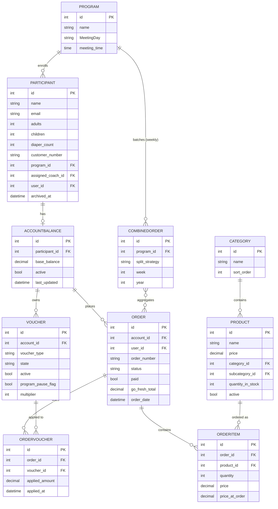
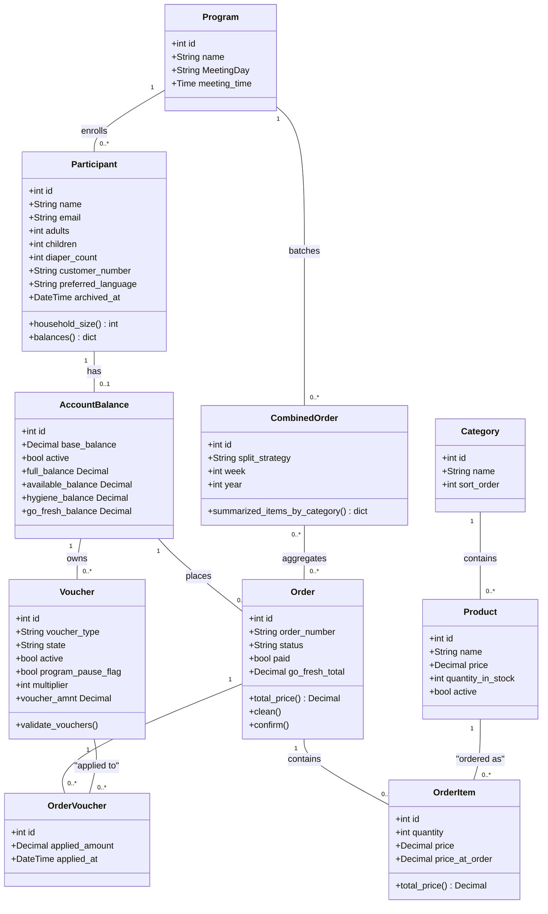

# Architecture Overview

> Last updated: 2026-07-13

This Django project follows a modular app layout. High-level apps of interest:

- `apps/account` — participants, account balances (`Participant`, `AccountBalance`, `GoFreshSettings`, `HygieneSettings`)
- `apps/pantry` — product/catalog, categories, ordering UI support (loaded first in `INSTALLED_APPS` via `PantryConfig`)
- `apps/orders` — order models, voucher consumption, packing/warehouse aggregation
- `apps/voucher` — voucher models, `VoucherSetting`, and `OrderVoucher` (the order/voucher join model lives here, not in `apps/orders`)
- `apps/lifeskills` — `Program`, `ProgramPause`, `LifeskillsCoach`
- `apps/log` — email delivery (`EmailType`, `EmailLog`), and audit logs (`OrderValidationLog`, `VoucherLog`, `UserLoginLog`, `GraceAllowanceLog`)
- `apps/api` — shared DRF plumbing: pagination, permission classes, and the `/api/v1/` URL router; no models of its own
- `core` — project settings, middleware, celery, and app wiring

## Balance System

`AccountBalance` (`apps/account/models.py`) is a `OneToOneField` to `Participant` and exposes four balance types as computed **properties** (not stored columns) that call into `apps/account/utils/balance_utils.py`:

1. **Full Balance** - Total value of all grocery vouchers not yet consumed or expired
2. **Available Balance** - Sum of up to 2 oldest applied grocery vouchers (multiplied by their multipliers)
3. **Hygiene Balance** - Configurable ratio (default 1/3) of available balance, reserved for hygiene products
4. **Go Fresh Balance** - Fixed per-order budget for fresh food based on household size, scaled by any active program-pause multiplier

### Balance Calculation Models

**Voucher-based (Available):** `calculate_available_balance()` sums up to N oldest applied vouchers
- `available_balance = sum(voucher.voucher_amnt * voucher.multiplier for oldest N applied grocery vouchers)`
- Default limit is 2 vouchers
- Respects ProgramPause gate logic (only includes `program_pause_flag=True` vouchers while a pause gate is active)
- Implementation: `apps/account/utils/balance_utils.py`

**Percentage-based (Hygiene):** `calculate_hygiene_balance()` calculated as a ratio of available balance
- `hygiene_balance = ceil(available_balance * HygieneSettings.hygiene_ratio)` (ratio defaults to 1/3, rounded up to a whole dollar)
- Ratio and enabled/disabled state are configurable via the `HygieneSettings` singleton (`apps/account/models.py`)
- Scales with overall shopping budget

**Fixed per-order (Go Fresh):** `calculate_go_fresh_balance()` — independent fixed amount based on household size
- Determined by `GoFreshSettings` thresholds (singleton model in `apps/account/models.py`, **not** `apps/pantry`)
- Multiplied by the currently active `ProgramPause` multiplier, if any
- Resets with each order (doesn't accumulate)
- Suitable for fresh/perishable items

See [GO_FRESH_BUDGET_FEATURE.md](GO_FRESH_BUDGET_FEATURE.md) for detailed Go Fresh implementation.

### Timezone Handling

**System Timezone:** `America/New_York` (EST/EDT with automatic DST)

**Critical Areas Using EST Conversion:**
- Program Pause ordering window detection (10-14 day window)
- Order window open/close calculations
- Scheduled task timing

**Implementation:** See `apps/lifeskills/utils.get_est_date()` for centralized timezone conversion.

⚠️ **Current Limitation:** System assumes all participants are in EST. Multi-timezone support requires model changes (see `docs/PROGRAM_PAUSES.md`).

Important notes:
- Mobile UI: `core/templates/pantry/create_order.html` contains the ordering interface (JS enhancements live in `apps/pantry/static/js/{cart,filter}.js`).
- Voucher consumption logic lives in `apps/orders/models.py::Order._consume_vouchers()`; voucher balance validation lives in `apps/voucher/models.py::Voucher.validate_vouchers()`.
- Order validation failures are written to `OrderValidationLog` (`apps/log/models.py`); failed order *attempts* (client-side rejections before submission) are captured separately in `FailedOrderAttempt` (`apps/orders/models.py`).
- Email sending uses Mailgun via `django-anymail` in production (`core/settings.py`); local/test environments use the console backend. Celery `CELERY_TASK_ALWAYS_EAGER` is forced `True` under pytest.

Migrations live under each app's `migrations/` directory. Tests are under each app's `tests/` directory and use `pytest-django`.

Diagrams
--------

Embedded below are Mermaid-format diagrams (ER and class diagrams) you can preview in VS Code or at https://mermaid.live.

ER diagram:

```mermaid
erDiagram
	PARTICIPANT {
		int id PK
		string name
		string email
		int adults
		int children
		int diaper_count
		string customer_number
		int program_id FK
		int assigned_coach_id FK
		int user_id FK
		datetime archived_at
	}
	ACCOUNTBALANCE {
		int id PK
		int participant_id FK
		decimal base_balance
		bool active
		datetime last_updated
	}
	VOUCHER {
		int id PK
		int account_id FK
		string voucher_type
		string state
		bool active
		bool program_pause_flag
		int multiplier
	}
	ORDER {
		int id PK
		int account_id FK
		int user_id FK
		string order_number
		string status
		bool paid
		decimal go_fresh_total
		datetime order_date
	}
	ORDERITEM {
		int id PK
		int order_id FK
		int product_id FK
		int quantity
		decimal price
		decimal price_at_order
	}
	ORDERVOUCHER {
		int id PK
		int order_id FK
		int voucher_id FK
		decimal applied_amount
		datetime applied_at
	}
	PRODUCT {
		int id PK
		string name
		decimal price
		int category_id FK
		int subcategory_id FK
		int quantity_in_stock
		bool active
	}
	CATEGORY {
		int id PK
		string name
		int sort_order
	}
	PROGRAM {
		int id PK
		string name
		string MeetingDay
		time meeting_time
	}
	COMBINEDORDER {
		int id PK
		int program_id FK
		string split_strategy
		int week
		int year
	}

	PROGRAM ||--o{ PARTICIPANT : enrolls
	PARTICIPANT ||--o| ACCOUNTBALANCE : has

	ACCOUNTBALANCE ||--o{ VOUCHER : owns
	ACCOUNTBALANCE ||--o{ ORDER : places

	ORDER ||--o{ ORDERITEM : contains
	PRODUCT ||--o{ ORDERITEM : "ordered as"

	ORDER ||--o{ ORDERVOUCHER : uses
	VOUCHER ||--o{ ORDERVOUCHER : "applied to"

	CATEGORY ||--o{ PRODUCT : contains

	PROGRAM ||--o{ COMBINEDORDER : "batches (weekly)"
	COMBINEDORDER }o--o{ ORDER : aggregates
```

Note: this diagram covers the core domain only. Not shown: `VoucherSetting`, `GoFreshSettings`, `HygieneSettings` (config singletons), `Subcategory`/`Tag`/`ProductLimit` (catalog refinements), `ProgramPause` (has no direct FK relationships — it gates balance/order behavior by time window, see the Balance System and Timezone Handling sections above), `PackingSplitRule`/`PackingList`/`WarehouseInventoryList` (warehouse fulfillment), `FailedOrderAttempt` (audit trail), and the `apps/log` audit/email models.

Class diagram:

```mermaid
classDiagram
	class Participant {
		+int id
		+String name
		+String email
		+int adults
		+int children
		+int diaper_count
		+String customer_number
		+String preferred_language
		+DateTime archived_at
		+household_size() int
		+balances() dict
	}
	class AccountBalance {
		+int id
		+Decimal base_balance
		+bool active
		+full_balance Decimal
		+available_balance Decimal
		+hygiene_balance Decimal
		+go_fresh_balance Decimal
	}
	class Voucher {
		+int id
		+String voucher_type
		+String state
		+bool active
		+bool program_pause_flag
		+int multiplier
		+voucher_amnt Decimal
		+validate_vouchers()
	}
	class Order {
		+int id
		+String order_number
		+String status
		+bool paid
		+Decimal go_fresh_total
		+total_price() Decimal
		+clean()
		+confirm()
	}
	class OrderItem {
		+int id
		+int quantity
		+Decimal price
		+Decimal price_at_order
		+total_price() Decimal
	}
	class OrderVoucher {
		+int id
		+Decimal applied_amount
		+DateTime applied_at
	}
	class Product {
		+int id
		+String name
		+Decimal price
		+int quantity_in_stock
		+bool active
	}
	class Category {
		+int id
		+String name
		+int sort_order
	}
	class Program {
		+int id
		+String name
		+String MeetingDay
		+Time meeting_time
	}
	class CombinedOrder {
		+int id
		+String split_strategy
		+int week
		+int year
		+summarized_items_by_category() dict
	}

	Program "1" -- "0..*" Participant : enrolls
	Participant "1" -- "0..1" AccountBalance : has
	AccountBalance "1" -- "0..*" Voucher : owns
	AccountBalance "1" -- "0..*" Order : places
	Order "1" -- "0..*" OrderItem : contains
	Product "1" -- "0..*" OrderItem : "ordered as"
	Order "1" -- "0..*" OrderVoucher : uses
	Voucher "1" -- "0..*" OrderVoucher : "applied to"
	Category "1" -- "0..*" Product : contains
	Program "1" -- "0..*" CombinedOrder : batches
	CombinedOrder "0..*" -- "0..*" Order : aggregates
```

You can also find source `.mmd` files in `docs/diagrams/` and instructions for rendering in `docs/diagrams/README.md`.

Rendered diagrams
-----------------

This document embeds Mermaid diagrams directly (see the blocks above). Modern GitHub Markdown and many Markdown renderers support Mermaid, so the `.mmd` sources in `docs/diagrams/` will be rendered inline on supported viewers.

If your renderer does not support Mermaid, view the diagrams at https://mermaid.live or install a Mermaid preview extension in your editor.