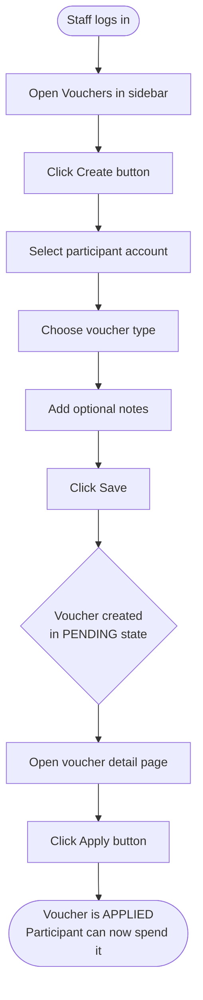

# Adding an Individual Voucher — Staff / Admin Guide

## Overview

Vouchers give participants shopping credit that they can use to place orders.
Sometimes you need to add a voucher for just one person — for example, to correct a
missing credit or issue a one-time award. This guide walks you through creating a
single voucher for any participant using the **Basketful admin panel**.

---

## Before You Start

- You must be logged in as a **staff or admin user**.
- The participant must already exist in the system with an active account.
- Decide which voucher type you need: **Grocery** (food items) or **Life Skills**.

---

## Step-by-Step

### 1 — Open the Vouchers section

1. Log in to the Basketful admin panel (usually at your pantry's admin URL).
2. In the left-hand navigation menu, click **Vouchers**.

   

---

### 2 — Click "Create"

On the Vouchers list page, click the **Create** button in the top-right toolbar.


---

### 3 — Fill in the voucher details

A short form will appear with the following fields:

| Field | What to enter |
|-------|---------------|
| **Account (Participant)** | Search for and select the participant by name |
| **Voucher Type** | Choose **Grocery** or **Life Skills** |
| **Notes** *(optional)* | Add any memo or reason for this voucher |

> 💡 **Tip:** Start typing the participant's name in the **Account** field to filter
> the drop-down list quickly.


---

### 4 — Save the voucher

Click the **Save** button (bottom-left of the form) to create the voucher.

You will be taken back to the voucher's detail page. The new voucher is now in
**Pending** state — it has been created but not yet added to the participant's spendable
balance.

---

### 5 — Apply the voucher

A voucher in **Pending** state does not yet count toward the participant's balance.
You need to **Apply** it to make it usable.

1. On the voucher's detail page, click the **Apply** button in the top toolbar.

   

2. The status badge changes from **PENDING** to **APPLIED**.
3. The voucher amount is now reflected in the participant's account balance and they
   can use it when placing an order.

---

## Voucher States at a Glance

```
PENDING  →  APPLIED  →  CONSUMED
                      ↘  EXPIRED
```

| State | Meaning |
|-------|---------|
| **PENDING** | Voucher created — not yet on the participant's balance |
| **APPLIED** | Active — participant can spend this credit |
| **CONSUMED** | Fully used in a completed order |
| **EXPIRED** | Voucher was not used and has been marked as expired |

---

## User Journey



---

## What If Something Goes Wrong?

**I can't find the participant in the Account drop-down.**
> The participant may not have an account set up yet, or their account may be
> inactive. Ask your admin to verify the participant's account status before
> creating the voucher.

**The Save button returns an error.**
> Make sure both **Account** and **Voucher Type** are filled in — they are required
> fields.

**The Apply button is not visible on the voucher detail page.**
> The **Apply** button only appears when a voucher is in **Pending** state. If the
> voucher is already **Applied**, **Consumed**, or **Expired**, the button will not
> show.

**I created the voucher but the participant says their balance hasn't changed.**
> Check that you completed Step 5 and clicked **Apply**. A voucher in **Pending**
> state is not reflected in the participant's available balance until it is applied.

---

## FAQs

**Q: What is the difference between Grocery and Life Skills vouchers?**
A: Grocery vouchers are used for regular food shopping orders. Life Skills vouchers
are for participants enrolled in a life skills program and cover different items.

**Q: Can I set the dollar amount of the voucher?**
A: No — the voucher amount is calculated automatically based on the pantry's current
voucher settings (amounts per adult, child, and infant in the household). You cannot
set a custom amount manually.

**Q: Can I edit a voucher after creating it?**
A: You can update the **Notes** field and toggle the **Active** flag from the Edit
screen. You cannot change the participant or voucher type after creation. You also
cannot edit a voucher that is in **Consumed** state.

**Q: How do I remove a voucher I created by mistake?**
A: Open the voucher, click **Expire** from the detail page toolbar to mark it as
expired. This prevents it from being used without deleting the record. Contact your
system administrator if you need a voucher fully deleted.

**Q: What is the difference between an individual voucher and bulk vouchers?**
A: An individual voucher is created for one specific participant. Bulk voucher
creation generates vouchers for all participants in an entire program at once. See
[BULK_VOUCHER_CREATION.md](../BULK_VOUCHER_CREATION.md) for the bulk creation guide.

---

## Related Documentation

- [VOUCHER_SYSTEM.md](../VOUCHER_SYSTEM.md) — Voucher model, states, and calculations
- [BULK_VOUCHER_CREATION.md](../BULK_VOUCHER_CREATION.md) — Creating vouchers for an entire program
- [ACCOUNT_BALANCES.md](../ACCOUNT_BALANCES.md) — How vouchers affect participant balances
